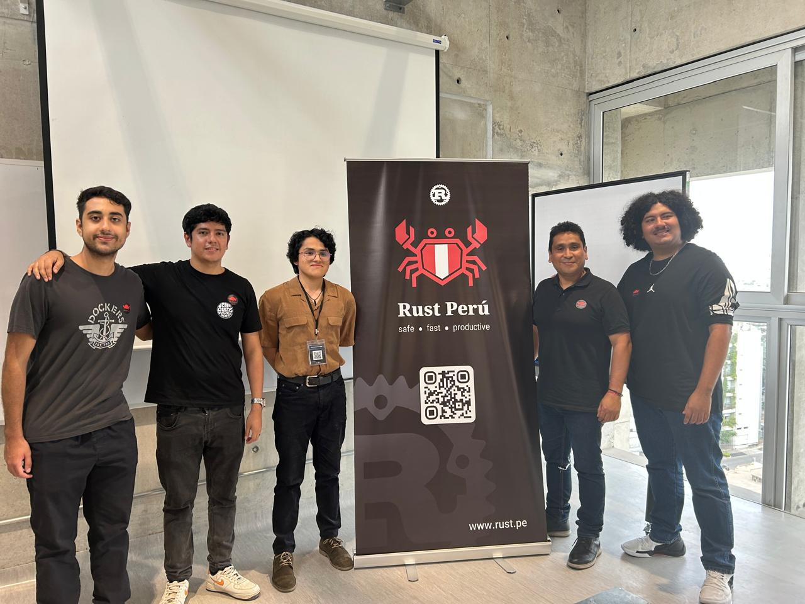
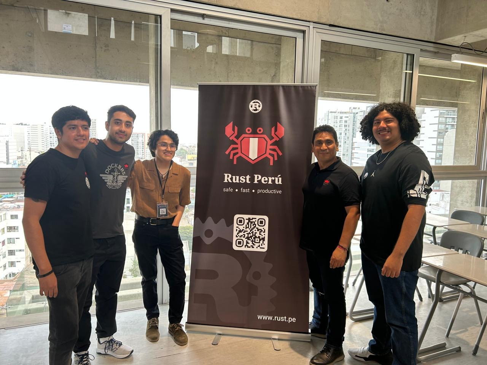

I participated as a speaker in a Rust talk hosted at the **Universidad de Ingeniería y Tecnología (UTEC)** in Lima, Peru. UTEC is a prominent private university located in the Barranco district, renowned for its strong focus on engineering, technology, innovation, and research, integrating artificial intelligence and modern sciences into its academic programs.

During the event, we discussed the history of Rust, the Free and Open Source Software (FOSS) ecosystem, its creation process, and the core structures of the language. My role was focused on teaching and communicating foundational concepts to the students and tech enthusiasts in attendance.

