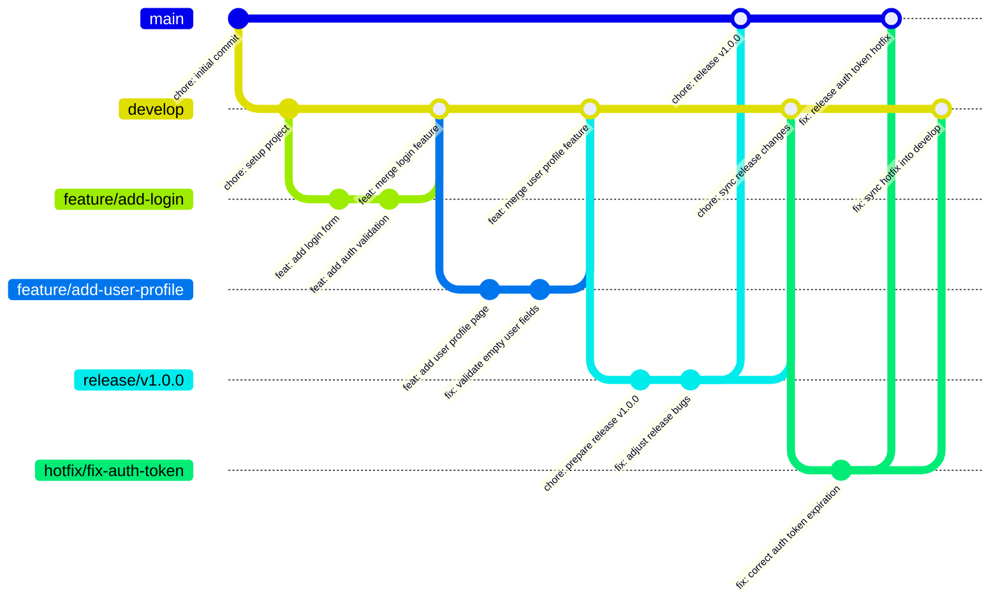

During university projects, I have noticed something that happens more often than it should: many students still share code through compressed `.zip` files instead of using version control. I do not think this always comes from laziness or bad practice; many times, it simply happens because no one has clearly explained how tools like Git can make collaboration easier.

Before diving in, it is important to clarify a common confusion: **Git** is the local version control system, **GitFlow** is a workflow for organizing branches, and **GitHub** is a platform for hosting repositories. GitHub is not the only option; alternatives such as **GitLab** and **Codeberg** also allow developers to host and collaborate on projects.

### What is GitFlow?

Created by **Vincent Driessen** in 2010, **GitFlow** is a Git workflow for organizing how a project is developed, reviewed, and released. It gives teams a simple way to work without stepping on each other's changes and to keep releases under control.

### What is a Branch?

A branch is just a separate line of work inside the same project. It lets you work on a feature, a fix, or a release without touching the stable version until it is ready.

### The Branching Structure

GitFlow uses a few branches, each with a clear job in the project lifecycle:

| Branch          | Type      | Description                                                  |
| --------------- | --------- | ------------------------------------------------------------ |
| **`main`**      | Core      | Stable production branch for released code.                  |
| **`develop`**   | Core      | Integration branch where completed work lands before release. |
| **`feature/*`** | Temporary | Created from `develop` and merged back into `develop` once the feature is done. |
| **`release/*`** | Temporary | Created from `develop` and merged into `main` after polishing and final checks. |
| **`hotfix/*`**  | Temporary | Created from `main` and merged into both `main` and `develop` to fix urgent production issues. |

### What is a Commit?

A commit is a saved snapshot of the project at one moment in time. It records exactly what changed, and its message tells you what kind of change it was.

These commit types make the history easy to read, so you can quickly tell whether a change adds something, fixes something, cleans up code, or updates project maintenance.

### Commit Types

| Type        | Meaning                                                     |
| ----------- | ----------------------------------------------------------- |
| `feat:`     | new feature                                                 |
| `fix:`      | bug fix                                                     |
| `docs:`     | documentation changes                                       |
| `style:`    | formatting, spaces, commas, no logic changes                |
| `refactor:` | internal code change without adding or fixing functionality |
| `test:`     | add or update tests                                         |
| `chore:`    | maintenance tasks                                           |
| `build:`    | build system or dependency changes                          |
| `ci:`       | continuous integration changes                              |
| `perf:`     | performance improvement                                     |
| `revert:`   | revert a previous commit                                    |
