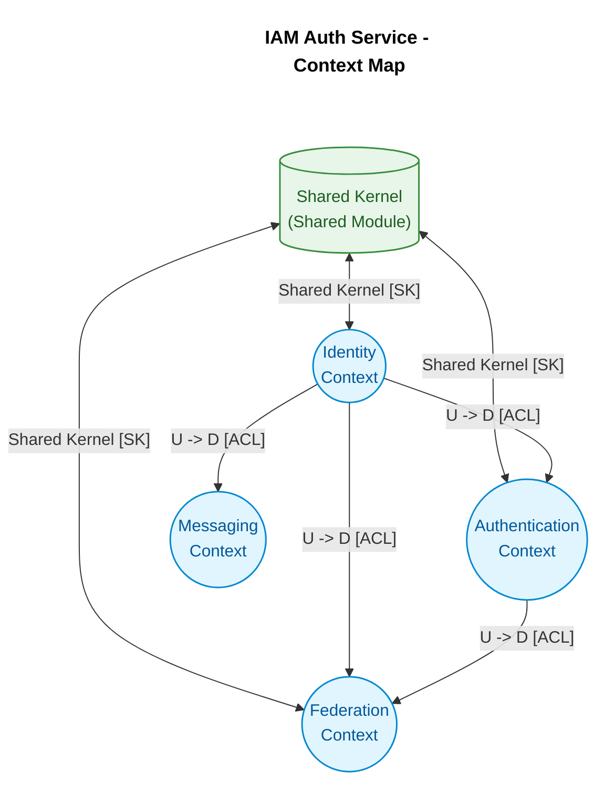
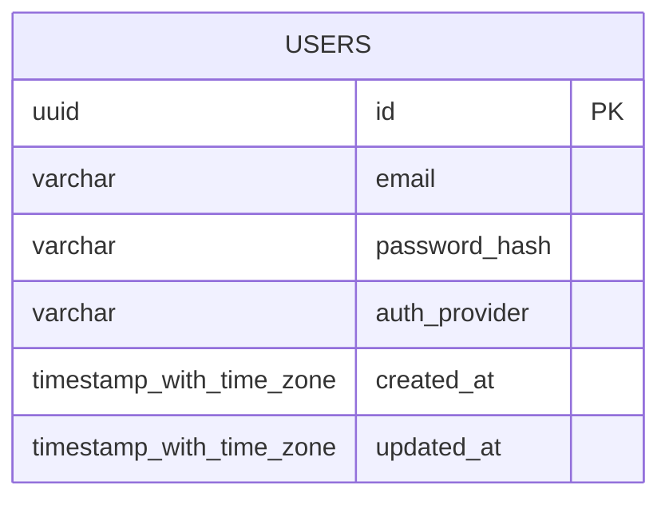
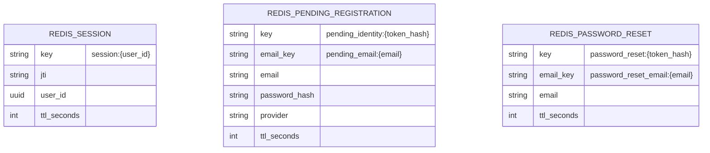

Designing an IAM service is mostly about tradeoffs. It has to be fast, secure, and predictable, but it also has to remain understandable as the system grows. In this project I wanted to explore whether Rust could give me tighter control over performance and memory while still supporting a clean architecture.

The result is an authentication service built around bounded contexts, a layered design, and a split between persistent and short-lived state. This post summarizes the problem, the architectural decisions, and what I learned while implementing it.

## 1. Why this project mattered

IAM services sit on the critical path of a platform. If they fail, every dependent application feels it immediately. That makes reliability and operational simplicity just as important as raw speed.

In JVM-based systems, common pain points include memory overhead, slower startup times, and less direct control over low-level resources. That does not make the JVM a bad choice, but for this project I wanted stronger control over performance and memory handling, especially around sensitive data such as passwords, session tokens, and recovery codes.

The goal was simple: build a service that can handle authentication traffic efficiently without turning the codebase into a maintenance burden.

## 2. Why Rust

I chose Rust because it combines strong memory safety with good performance and no garbage collector. That combination fits an IAM service well, especially when the system needs to process cryptographic operations, manage concurrent requests, and keep sensitive data in memory only briefly.

Rust also pushes design decisions earlier. The borrow checker and ownership model make memory and concurrency issues visible at compile time, which reduces the chance of runtime surprises. For a service that must remain predictable under load, that was a major advantage.

Benchmarks from TechEmpower show that Rust frameworks can deliver strong throughput with a small memory footprint (TechEmpower, 2023). That was a useful signal, but the bigger reason was the overall balance between safety, speed, and operational simplicity.

## 3. Architecture

The system is organized around Domain-Driven Design and split into four bounded contexts (Evans, 2003):

- Identity: registration, confirmation, and password recovery.
- Authentication: login, sessions, and JWT issuance or revocation.
- Federation: external login through providers like Google OAuth.
- Messaging: email notifications such as verification and recovery messages.

Shared concerns such as rate limiting, account lockout, and request validation live in a shared module. That keeps the code reusable without mixing infrastructure or security helpers into the core domain logic.

Each context follows the same four-layer structure: interfaces, application services, domain, and infrastructure. The API is built with Axum, PostgreSQL stores persistent data, and Redis handles short-lived state such as sessions, verification codes, and lockouts.

## 4. System views

To document the architecture, I used two complementary views:

- DDD context mapping to show the domain boundaries and relationships.
- The C4 model to show the system at different levels of detail (Brown, 2018).

This combination makes it easier to explain both the business structure and the technical structure of the service.

### 4.1 Context mapping

The context map shows how the bounded contexts relate to each other. The main design goal was to keep responsibilities separate and avoid mixing unrelated concerns.

While defining the boundaries, I made a few deliberate choices:

- Email notifications were moved into a separate Messaging context instead of being embedded in Identity.
- Registration and session handling were split into Identity and Authentication because they have different responsibilities and different load patterns.
- Google OAuth was isolated in Federation so changes in external APIs would not affect the core authentication flow.
- Shared security concerns were kept in a shared module so they could be reused without duplicating logic.

### 4.2 C4 context diagram

The C4 context diagram gives a high-level view of the system. It shows how the IAM service interacts with users, the frontend client, Google OAuth, and SMTP services (Brown, 2018).

### 4.3 Container diagram

The container diagram shows the main runtime pieces of the system: the Axum API, PostgreSQL, and Redis (Brown, 2018).

### 4.4 Component diagram

The component diagram shows the internal structure of the Axum API container. It highlights the separation between REST interfaces, application services, domain logic, and infrastructure adapters (Brown, 2018).

### 4.5 Data model

The data model is intentionally split between durable and temporary storage.

PostgreSQL stores the persistent user identity data:

Redis stores short-lived state with TTL, including active sessions, pending registrations, and password reset tokens:

## 5. Implementation notes

I also built a small Next.js and React frontend demo to test the authentication flow from the client side. The page uses a simple auth layout with a background, a header, a Google sign-in button, a divider, and a registration form. That let me validate the user flow end to end before treating the frontend as a real product surface.

The backend covers account lockout protection, JWT session invalidation, verification codes sent by email, and a separate Federation context for Google OAuth. Together, those pieces make the service secure without turning the request path into a blocking workflow.

## 6. What I learned

This project was a good introduction to Rust's ownership model, lifetimes, and borrow checker. The main adjustment at the beginning was moving from the flexibility of garbage-collected languages to the stricter rules of a compiler that asks hard questions early.

I also made some architecture mistakes at first, especially around traits, mocks, and dependency injection in tests. Working through those issues led to cleaner abstractions and better test boundaries.

The biggest lesson was that Rust forces you to think carefully about ownership and system design before writing code. That made development slower at first, but the payoff was a codebase with clearer boundaries and fewer runtime bug classes.

## 7. Conclusion

The final result is a secure IAM service built with Rust, PostgreSQL, and Redis, organized around domain boundaries instead of ad hoc modules. For this kind of system, that structure matters as much as the implementation itself.

Future iterations will focus on better testing, benchmarking, MFA, and more idiomatic zero-copy patterns where they make sense.

## 8. References

- Brown, S. (2018). *Software architecture for developers: Volume 2: Visualise, document and explore*. Leanpub. https://c4model.com/
- Evans, E. (2003). *Domain-driven design: Tackling complexity in the heart of software*. Addison-Wesley Professional.
- zGIKS. (2026). *Frontend demo screenshot* [Screenshot]. Imgur. https://imgur.com/Px5LQ7d
- zGIKS. (2026). *iam-demo*. GitHub. https://github.com/zGIKS/iam-demo
- TechEmpower. (2023). *Web framework benchmarks (Round 23)*. https://www.techempower.com/benchmarks/#section=data-r23
